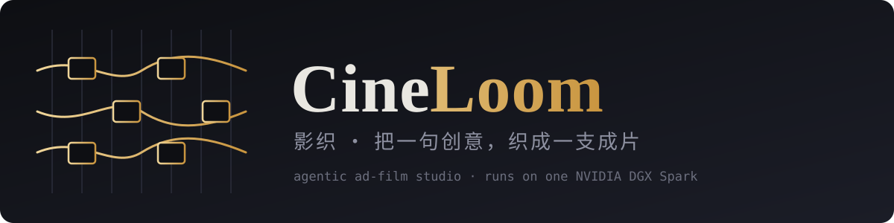
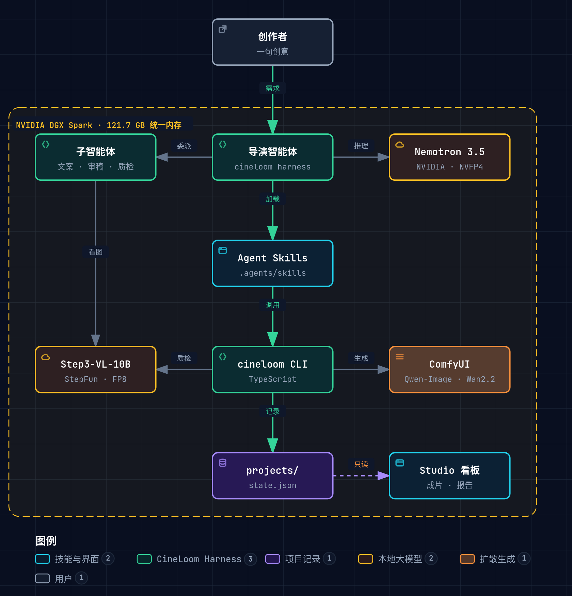

<p align="center">
  
</p>

<p align="center">
  <a href="LICENSE"></a>
  
  
  
  
  
</p>

<p align="center">
  <a href="#项目说明">项目说明</a> ·
  <a href="#快速开始">快速开始</a> ·
  <a href="#部署说明">部署说明</a> ·
  <a href="#成片展示">成片展示</a> ·
  <a href="#agent-skills">Agent Skills</a> ·
  <a href="#技术栈说明">技术栈</a> ·
  <a href="#当前状态">当前状态</a>
</p>

**CineLoom（影织）** 是一个跑在单台 NVIDIA DGX Spark 上的广告成片智能体。你说一句创意，它完成写脚本、审文案、排分镜、生图、质检、生视频、剪辑，交付一支可以直接发布的短片。素材和模型全程留在本机。

```text
> 给一款还没发布的无糖气泡水做一条 15 秒竖版广告，产品图在 refs/ 里

  ✓ 需求    确认受众与核心信息，立项 summer-soda（9:16 · 15s · 仅本地）
  ✓ 脚本    3 个节拍：钩子 / 证明 / 行动号召
  ✓ 合规    拦下“全网第一”“100%”，改写后通过
  ✓ 分镜    3 个镜头，统一风格行，产品参考图优先
  ✓ 生图    Qwen-Image · Spark 本地
  ✓ 质检    Step3-VL 复核产品一致性，镜头 2 重生成 1 次
  ✓ 生视频  Wan2.2 · 首帧驱动
  ✓ 成片    projects/summer-soda/cut/final.mp4
```

<sub>上面是流程示意，不是运行记录；真实运行数据见<a href="#当前状态">当前状态</a>。</sub>

> 第三届 NVIDIA DGX Spark 黑客松 · Agent Skills 开发挑战赛参赛作品 · 方舟团队

---

## 项目说明

### 解决什么问题

品牌方和中小商家做一条短视频广告，要经过策划、文案、分镜、拍摄或生成、剪辑五六个环节。现有的 AI 视频工具把这些环节接到了云端 API 上，带来三个实际问题：

- **未发布的新品素材不能上云。** 新品图、包装稿、代言人素材在发布前受保密约束，上传到第三方生成服务本身就是风险。
- **按条计费让迭代变贵。** 广告要反复改，一个镜头重生成五次是常态，云端视频生成按次收费，试错成本直接劝退。
- **生成结果没人把关。** 文案里一句“全网第一”、画面里一个变形的 logo，到了成片阶段才发现，整条重做。

### CineLoom 怎么做

CineLoom 把整条流水线搬到一台 DGX Spark 上，并把每个环节的专业判断写成 **Agent Skill**：

- **一个导演，多个子智能体，九项技能。** `cineloom harness "一句创意"` 启动 **CineLoom Harness**——CineLoom 自己的智能体运行框架：八个阶段由代码保证顺序，每个阶段交给一个加载了对应 Skill 的子智能体（需求、文案、审稿、分镜、质检）。**代码管顺序和验收，模型管判断**——每份产出先过确定性校验，不合格就带着具体问题重写。
- **先审后生成。** 文案先过《广告法》用词扫描（本地、可复现），再交给一个“没写这份稿”的审稿智能体；有 `block` 级问题的文案到不了生成环节。
- **产品定妆图锁定一致性。** 先生成一张产品定妆图并过质检，之后每个镜头都从这张图出发生成。只靠文字描述时，产品会在镜头之间漂移（实测：镜头 1 是青色罐，镜头 3 变成了银色罐）。
- **画面里不让模型画字。** 标题和字幕在后期用真字体排版。实测模型会把“气泡细腻”画两遍，把风格词里的“50mm”当成文字画进画面，把生僻字“泠”画成“冷”。
- **首帧过质检，才生成视频。** 本地 StepFun 视觉模型对照定妆图复核每一帧：内容缺失、多余文字、乱码、产品不符，任何一条都拒；被拒的帧按问题类型改提示词重生成，最多两次。把返工拦在 20 多秒的生图阶段，而不是 6 分钟的生视频阶段。
- **一个内存池里排兵布阵。** GB10 的 CPU 和 GPU 共用约 121 GB 统一内存。两个 LLM 常驻；Harness 在每个阶段切换时释放上一阶段的扩散模型，再加载下一个。
- **过程对人可见。** [Studio](#studio) 里输入创意、点“开拍”，实时看到每个阶段、每帧的质检结论、每个素材的生成位置和耗时，以及统一内存占用。

### 架构

<p align="center">
  
</p>

<p align="center"><sub><a href="docs/architecture/cineloom-architecture.html">可交互版本</a>（缩放、搜索、关系追踪）· 用 <a href="https://github.com/tt-a1i/archify">archify</a> 绘制</sub></p>

设计取舍：

- **Harness 分阶段推进，而不是放任模型自由循环。** 广告成片本来就是流水线；把顺序和验收交给代码，稳定、可测，“带 / 不带 Skill”的对比也能用同一套校验器打分。
- **Skill 是开放格式，不绑定运行时。** 九个 Skill 通过 `cineloom` 子命令做事，输入输出都是文件和 JSON。CineLoom Harness 是自带的运行框架；同一批 Skill 也能被 Claude Code、Codex、DeepSeek Harness 等支持 Agent Skills 的客户端直接加载。
- **模型按实测分工，不按想象分工。** Nemotron 关掉思考后 0.3 秒就能给出结构化结果，适合规划、文案、审稿和英文提示词；Step3-VL-10B 关不掉思考、约 18 token/秒，做长文本审稿会超时，但看图质检只要 10 秒左右——所以它只负责“看”。
- **记录即界面。** Studio 只读 `projects/` 目录里的记录，不持有状态。

## 快速开始

```bash
git clone git@github.com:hojiahao/cineloom.git && cd cineloom
npm install && npm run build
npm test                      # 23 个测试，含一条从立项到成片的端到端流程

node dist/cli.js studio       # 打开 http://127.0.0.1:3090 ，输入创意，点“开拍”
node dist/cli.js harness "给一款叫“冷”的无糖气泡水做一条 15 秒竖版广告，面向大学生"   # 或者用命令行
```

不需要 GPU 就能试的两个命令：

```bash
echo "全网第一的气泡水，100%天然" | node dist/cli.js copy-check - --category food   # 合规扫描
node dist/cli.js shots some-ad.mp4 --out breakdown                                 # 参考片切镜
```

## 部署说明

### 1. 本地算力如何部署智能体

```bash
HF_ENDPOINT=https://hf-mirror.com scripts/download-models.sh   # 权重约 109 GB，可断点续传
scripts/spark-up.sh                                            # 起 Nemotron、Step3-VL、ComfyUI 并自检
```

`spark-up.sh` 会先检查统一内存余量（默认要求 95 GB 可用，不足则拒绝启动，避免模型加载到一半被杀），起好三个服务后运行 `cineloom doctor`，把工作流模板和正在运行的 ComfyUI 逐节点对一遍，缺节点、缺权重当场报出来。

三个服务就绪后，`cineloom harness` 和 Studio 就能用了。Harness 默认连本机的三个端口（Nemotron 8001、Step3-VL 8002、ComfyUI 8188），可用环境变量改：`CINELOOM_PLANNER_URL`、`CINELOOM_VISION_URL`、`COMFYUI_URL`。配置了 `STEPFUN_API_KEY` 时，文字审稿改由 StepFun 开放平台的 Step-3.7-Flash 承担，并在记录里标注 `cloud`；不配置则全程本地。

这台机器上踩过的坑都已写进配置：Docker 通过 CDI（`nvidia.com/gpu=all`）而不是 `runtime: nvidia` 暴露 GPU；Step3-VL 的 FP8 权重要设 `VLLM_USE_DEEP_GEMM=0`；ComfyUI 镜像直接建在 vLLM 镜像上，复用已在 GB10 上验证过的 PyTorch。

### 2. 如何优化大模型

| 手段 | 做法 | 为什么 |
|---|---|---|
| NVFP4 量化 | Nemotron 3.5 Lightning 30B-A3B 用官方 NVFP4 权重，21.6 GB | 30B 参数只激活 3B，GB10 的内存带宽是瓶颈，权重越小解码越快 |
| 投机解码 | 搭配官方 `-DSpark` 草稿权重，`num_speculative_tokens=3` | NVIDIA 为 DGX Spark 低并发场景调优的方案，无损加速 |
| FP8 KV cache 与前缀缓存 | `--kv-cache-dtype fp8 --enable-prefix-caching` | 导演智能体每轮都带同一段系统提示和 Skill，前缀命中率高 |
| FP8 视觉模型 | Step3-VL-10B-FP8，15.1 GB；设 `VLLM_USE_DEEP_GEMM=0` | 质检要常驻，体积必须小。DeepGEMM 的 FP8 内核在 GB10 上断言失败，改走 vLLM 通用 FP8 路径 |
| 8 步蒸馏 LoRA | Qwen-Image + Lightning 8-step，cfg 1 | 单张 1080×1920 首帧实测 22.7 秒，质检重生成才负担得起 |
| 14B 视频模型 + 4 步蒸馏 | Wan2.2 I2V A14B（FP8，高噪/低噪两个专家）+ lightx2v 4-step LoRA | 实测 353 秒一段，不比 5B 模型（365 秒）慢，画面明显更好，因此设为默认 |
| 按任务开关思考 | 脚本、分镜、审稿关闭 Nemotron 的思考模式 | 开着时会把整个 token 额度用在推理上、正文为空；关掉后 0.3 秒出结构化结果，由校验器和重试兜底 |
| 原生分辨率预算 | 超过 1328×1328 像素总量的请求先按预算生成再放大 | 扩散耗时随像素数增长，预算内生成、Lanczos 放大 |
| 分阶段显存调度 | vLLM 按总内存池比例预占（0.25 + 0.20）；Harness 在定妆图、首帧、视频三个阶段切换时调用 ComfyUI `/free` | 三个扩散模型同时留在内存里会让 GPU 驱动分配失败（实测发生过），一次只留一族 |

**本机实测（2026-09-21，DGX Spark，单请求）**

| 项目 | 实测值 |
|---|---|
| Nemotron 3.5 Lightning 解码速度（含 DSpark 投机解码，端到端） | 98–106 tok/s（900 token，两次） |
| Nemotron 工具调用一次往返 | 1.0 s，参数正确 |
| Nemotron 服务占用统一内存 | 约 35 GB（可用内存 108.6 → 73.6 GB） |
| Step3-VL-10B 权重加载 | 14.25 GiB，81.9 s |
| Step3-VL-10B KV cache（内存比例 0.20） | 47,616 token，32K 上下文可用 |
| 两个 LLM 同时常驻后的可用统一内存 | 47.6 GB |
| `cineloom qa` 单张首帧质检 | 首次 26 s（含预热），之后 10 s |
| Qwen-Image 首帧 1080×1920（8 步） | 首次 45.8 s（含加载），之后 22.7 s |
| Wan2.2 TI2V-5B，5 秒 720p 竖版片段 | 365 s |
| Wan2.2 I2V A14B + 4 步 LoRA，5 秒 720p 竖版片段 | 353 s |
| Harness 方案阶段（需求 → 脚本 → 合规 → 分镜） | 157 s（旧版，含一次失败的审稿）；关掉思考后脚本 5.5 s、分镜 4.3 s |
| 第一支端到端成片（旧流水线，5B 视频模型，15 秒 3 镜头，质检重生成 4 次） | 1453 s |

Nemotron 默认先推理再作答，推理内容计入 `max_tokens`；给得太小时正文会为空。

启动参数取自各模型卡的 DGX Spark 配方，完整写在 [`deploy/spark/compose.yaml`](deploy/spark/compose.yaml)。

### 3. 如何设计 Agent Skills

- **一个 Skill 只管一个判断。** “写脚本”和“审脚本”是两个 Skill，而且导演规则要求审查方不能是产出方。
- **description 写触发条件，不写功能介绍。** 每条都包含“什么时候用”和用户会说的原话（如“能不能这么说”“拉片”），智能体靠它决定加载哪个 Skill。
- **能确定的交给脚本，要判断的留给模型。** 广告法用词、切镜头、内存预算是确定性问题，由 `cineloom` 命令给出可复现的结果；是否有依据、怎么改写，才由模型判断。
- **写明失败分支。** 每个 Skill 都有“出错了怎么办”：质检不过怎么改提示词、切镜结果只有一个镜头怎么调阈值、工作流被拒先跑 `doctor`。
- **格式对齐 NVIDIA 官方 Skills 仓库。** frontmatter 带 `version`、`license`、`metadata`；每个 Skill 附 `evals/evals.json`（共 20 条任务，含正例和边界情况），用于“带 / 不带 Skill”的对比评测。

## Agent Skills

| Skill | 阶段 | 做什么 | 依赖的命令 / 模型 |
|---|---|---|---|
| [`ad-brief-intake`](.agents/skills/ad-brief-intake/SKILL.md) | 需求 | 只问阻塞项，其余自己定并说明，立项 | `cineloom project init` |
| [`ad-script-writing`](.agents/skills/ad-script-writing/SKILL.md) | 脚本 | 5 秒一个节拍，口播字数预算，首拍无声可懂 | Nemotron / Step3-VL |
| [`ad-compliance-review`](.agents/skills/ad-compliance-review/SKILL.md) | 合规 | 《广告法》用词筛查，`block` 级必须改写 | `cineloom copy-check` |
| [`ad-reference-breakdown`](.agents/skills/ad-reference-breakdown/SKILL.md) | 拉片 | 参考片切镜、逐镜描述、映射到新产品 | `cineloom shots` · Step3-VL |
| [`storyboard-design`](.agents/skills/storyboard-design/SKILL.md) | 分镜 | 统一风格行、单镜单动作、参考图分配 | Nemotron |
| [`spark-local-media-generation`](.agents/skills/spark-local-media-generation/SKILL.md) | 生图 / 生视频 | 本地生成，先图后视频 | `cineloom image` / `video` · Qwen-Image · Wan2.2 |
| [`shot-quality-gate`](.agents/skills/shot-quality-gate/SKILL.md) | 质检 | 产品一致性复核，按问题类型重生成，最多两次 | `cineloom qa` · Step3-VL |
| [`final-cut-assembly`](.agents/skills/final-cut-assembly/SKILL.md) | 成片 | 统一规格拼接、字幕、配乐、交付报告 | `cineloom cut` · ffmpeg |
| [`spark-model-scheduler`](.agents/skills/spark-model-scheduler/SKILL.md) | 贯穿 | 统一内存先量后排，分阶段加载释放 | `cineloom mem` |

### 带 Skill 和不带 Skill 的差别

同一个 Nemotron、同一批 8 个创意各跑 2 轮，唯一变量是子智能体的系统提示里有没有对应的 Skill。每个阶段只给一次机会，用导演自己的校验器（[`src/agent/checks.ts`](src/agent/checks.ts)）数违规条数。

| | 不带 Skill | 带 Skill |
|---|---:|---:|
| 脚本一次合格 | 0/16 | 6/16 |
| 脚本平均违规数 | 3.63 | 1.06 |
| 分镜一次合格 | 0/16 | 8/14 |
| 分镜平均违规数 | 8.00 | 0.71 |

不带 Skill 时最常见的错误：用中文写图片提示词（35 次）、一个镜头塞多个运镜（29 次）、字幕超长（22 次）、节拍数不对（12 次）、风格词里带数字（10 次）——每一条都会直接毁掉成片。带 Skill 后仍有残留问题（口播偏短、偶尔中文提示词），已反馈进 Skill 文本。校验器查的是形式，不是文案好坏；这次评测与成片任务并行，耗时数字不可信，未列出。完整报告：[脚本](.agents/skills/ad-script-writing/BENCHMARK.md) · [分镜](.agents/skills/storyboard-design/BENCHMARK.md) · [原始数据](eval/results/ablation.json)。复现：`cineloom eval --repeats 2`。

## Studio

`node dist/cli.js studio` 在 `http://127.0.0.1:3090` 提供工作台：输入创意、选画幅时长和视频模型、点“开拍”，导演就在后台开工（一次只拍一支，GPU 只有一块）。页面实时显示运行日志、八个阶段的状态、按镜头排列的首帧和片段、每个素材的生成位置与实测耗时、成片播放，以及统一内存占用条。

## 技术栈说明

**NVIDIA**

| 组件 | 用途 |
|---|---|
| DGX Spark（GB10 Grace Blackwell，aarch64，统一内存） | 全部推理与生成的运行平台 |
| `nvidia/NVIDIA-Nemotron-3.5-Lightning-30B-A3B-NVFP4` | 导演智能体主模型：规划、工具调用、英文提示词 |
| `nvidia/NVIDIA-Nemotron-3.5-Lightning-30B-A3B-NVFP4-DSpark` | 为 DGX Spark 调优的投机解码草稿权重 |
| NVFP4 量化（TensorRT Model Optimizer 产出的官方权重） | 降低权重体积与带宽压力 |
| NVIDIA Container Toolkit · NGC PyTorch 容器（arm64） | GPU 容器运行时；ComfyUI 的基础镜像 |
| CUDA | vLLM 与 ComfyUI 的计算后端 |
| [NVIDIA/skills](https://github.com/NVIDIA/skills) 规范 | Skill 的 frontmatter、`evals/`、评测报告格式对齐 |

**StepFun 阶跃星辰**

| 组件 | 用途 |
|---|---|
| `stepfun-ai/Step3-VL-10B-FP8`（本地，vLLM） | 中文文案润色；镜头质检；参考片逐镜理解 |
| Step-3.7-Flash（StepFun 开放平台 API，可选） | 创意总监级的方案发散。198B 参数，IQ4_XS 量化仍需约 116 GB，无法与扩散模型同机共存，因此走云端并在记录里标注 `cloud` |

**其他开源组件**

| 组件 | 用途 |
|---|---|
| vLLM | 两个 LLM 的 OpenAI 兼容服务 |
| ComfyUI · Qwen-Image / Qwen-Image-Edit-2509（含 Lightning 8-step LoRA） | 首帧生成；带产品参考图的生成；能渲染中文字 |
| ComfyUI · Wan2.2 I2V A14B（FP8）+ lightx2v 4-step LoRA | 默认视频模型：首帧驱动的 5 秒片段 |
| ComfyUI · Wan2.2 TI2V-5B | 备选视频模型，支持无首帧的文生视频 |
| ffmpeg · libass | 参考片切镜、尾帧续接；成片的转场、调色、颗粒、暗角和真字体标题字幕 |
| TypeScript · Node.js 22 · Vitest | CineLoom Harness、CLI、Studio 与测试（零运行时依赖） |
| [archify](https://github.com/tt-a1i/archify) | 架构图 |

## 当前状态

如实记录，随开发更新。

- [x] 自研智能体框架 CineLoom Harness（`cineloom harness`）：一句创意到成片，八个阶段、多个子智能体，全部在本机
- [x] Nemotron、Step3-VL、ComfyUI 三个服务在同一台 DGX Spark 上常驻运行；全部权重（约 140 GB）已下载
- [x] 第一支端到端成片（旧流水线）：1453 秒；质检闭环真实触发 4 次重生成
- [x] 新流水线：产品定妆图锁定、画面无字、严格质检、14B 视频模型、电影化后期
- [x] Studio 工作台：网页提交创意、实时进度
- [x] “带 / 不带 Skill”对比评测与两份 `BENCHMARK.md`
- [x] 23 个测试通过，端到端测试走真实 ffmpeg
- [ ] 配音、音乐与音效（目前成片无声）
- [ ] 每镜头多候选选优
- [ ] 演示视频（B 站）与“十日谈”发布

本仓库不会出现未经实测的性能数字。

## 目录

```text
AGENTS.md                导演智能体的流水线与规则
.agents/skills/          9 个 Agent Skill（SKILL.md · references · evals）
src/agent/               CineLoom Harness：导演与子智能体、校验器、评测
src/                     cineloom CLI、媒体管线与 Studio（TypeScript）
workflows/               ComfyUI API 格式的工作流模板
deploy/spark/            本地推理栈（compose）、Harness 提供方配置
scripts/                 模型下载、一键启动
eval/                    评测用创意与原始结果
tests/                   单元测试与端到端流水线测试
```

## 致谢与许可

CineLoom 以 [MIT 许可证](LICENSE) 发布，版权归方舟团队所有。运行时依赖 vLLM、ComfyUI，以及 NVIDIA、StepFun、Qwen、Wan 团队开源的模型，各自遵循其许可证。用 CineLoom 生成并对外发布的内容，请按平台规范标注“AI 生成”。
