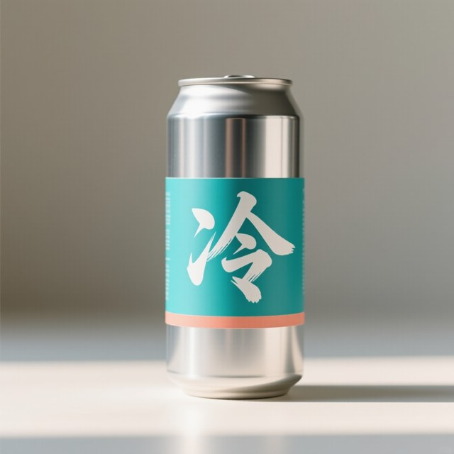
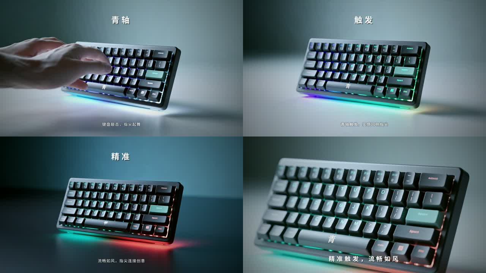
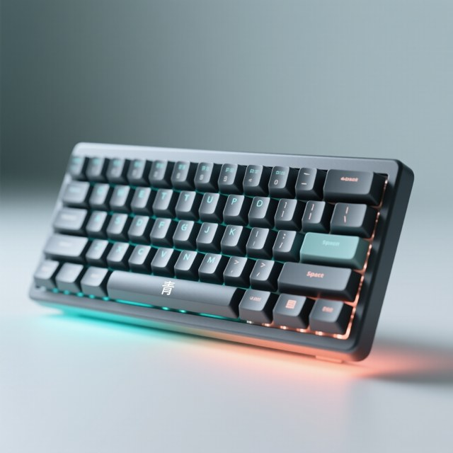
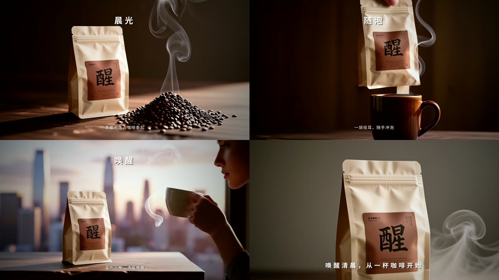
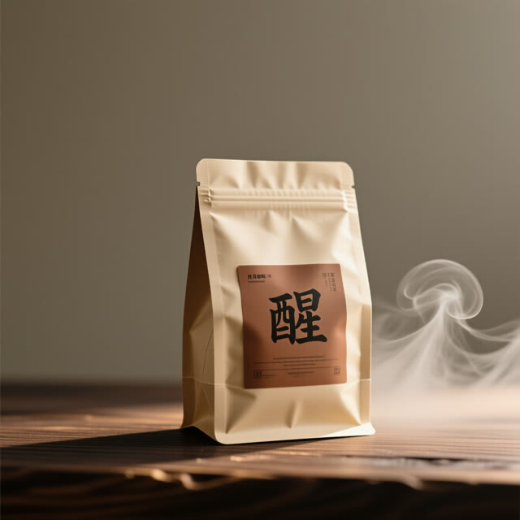

<p align="center">
  
</p>

<p align="center">
  <a href="LICENSE"></a>
  
  
  
  
  
</p>

<p align="center">
  <a href="#成片展示">成片展示</a> ·
  <a href="#项目说明">项目说明</a> ·
  <a href="#快速开始">快速开始</a> ·
  <a href="#部署说明">部署说明</a> ·
  <a href="#agent-skills">Agent Skills</a> ·
  <a href="#技术栈说明">技术栈</a> ·
  <a href="#当前状态">当前状态</a>
</p>

**CineLoom（影织）** 是一个跑在单台 NVIDIA DGX Spark 上的广告成片智能体：你说一句创意，它交付一支有画面、有配音、有音乐、字幕正确、文案合规的短片。素材、模型、生成的每一帧全程留在本机。

**它解决的三个痛点，以及对应的做法：**

| 痛点 | 现有 AI 视频工具 | CineLoom |
|---|---|---|
| 未发布新品的素材不能上云 | 生图生视频全走云端 API | Nemotron、StepFun、Qwen-Image、Wan2.2 全部跑在一台 Spark 上；无网络也能出片 |
| 产品在镜头之间变样、画面里出现乱码字 | 每个镜头单独一段提示词，模型画字 | 先出一张过质检的**产品定妆图**，每帧都从它生成；画面里**不让模型画字**，标题字幕在后期用真字体排版 |
| 生成结果没人把关，返工在最贵的环节 | 生成完再看 | **文案先过《广告法》扫描和独立审稿**才能进生成；**每帧先过视觉质检**（对照定妆图）才能生视频，把返工拦在 20 秒的生图阶段，而不是 6 分钟的生视频阶段 |

**一次真实运行的记录**（2026 年 9 月 21 日，项目 `leng-soda-v2`，本机，未剪辑）：

```text
> 给一款叫“冷”的无糖气泡水做一条 15 秒竖版短视频广告，面向大学生，夏天，清爽。

  需求      1.3 s   立项：9:16 · 15 s · 品类 food · 仅本地
  脚本      5.3 s   第 1 稿被校验器退回（口播过短），第 2 稿通过
  合规      1.1 s   独立审稿智能体通过，用词扫描 0 项
  分镜      4.3 s   3 个镜头 · 风格行 · 产品描述一次成型
  定妆图            第 1 张被质检拒绝（标签侧面多余小字）→ 第 2 张 90 分通过
  首帧 ×3          镜头 1、2 各被拒 1 次（罐子倾斜 / 品牌字不符）后通过；镜头 3 一次通过
  视频 ×3          Wan2.2 14B · 355 / 365 / 358 s
  成片             配音 ×3 + 音乐 9.1 s + 混音 + 调色 + 字幕 = 45 s
  ────────────────────────────────────────────────
  总计   2044 s    2 次重生成，全程 DGX Spark 本地，1080×1920 · 24 fps · 有声
```

> 第三届 NVIDIA DGX Spark 黑客松 · Agent Skills 开发挑战赛参赛作品 · 方舟团队

---

## 成片展示

每支案例都由 `cineloom harness` 从一句创意在本机一次跑完，画面直接取自成片，没有手工修饰。正文只放成片本身；规格、创意原话、四格画面、定妆图和逐阶段的运行记录收在每支下方的折叠块里。

### 案例一 · 饮料：无糖气泡水“冷”（15 秒竖版广告）

<!-- video:soda-9x16 -->

https://github.com/user-attachments/assets/495bebb6-a63a-409f-8290-4b5b3d02419a

<details>
<summary>创意原话、四格画面、定妆图与这次运行的记录</summary>

> 创意原话：给一款叫“冷”的无糖气泡水做一条 15 秒竖版短视频广告，面向大学生，夏天。电影质感：微距、冰、气泡、逆光，节奏克制。

<p align="center"></p>

<p align="center"><br><sub>产品定妆图：整支片的每一帧都从它生成</sub></p>

| 阶段 | 记录 |
|---|---|
| 规格 | 原片 1080×1920（竖版）· 24 fps · 实际时长 16.8 秒（含 3 秒结尾定版）· 配音与音乐均为本地生成；README 中的播放版本为 16:9 画框内居中呈现 |
| 脚本 · 合规 | 三个节拍：“一口下去，气泡在舌尖炸开 / 无糖配方，入口即化 / 夏日清爽，随时开启”；用词扫描 0 项，独立审稿通过 |
| 定妆图 | 第 1 张即以 100 分通过；之后三个镜头都从它生成，罐身、色带、书法“冷”字在整支片里是同一只罐 |
| 首帧 · 质检 | 每镜头 2 个候选。镜头 1 两个候选都因“罐子未立起”被拒，改提示词重生成后 100 分；镜头 2 第 1 候选因“冰晶未出现”被拒，第 2 候选通过；镜头 3 两个候选都通过，取高分。共 8 次质检、1 次重生成 |
| 视频 | Wan2.2 14B，三段各 367 / 346 / 343 秒 |
| 成片 | 配音 3 句（3.7 / 2.9 / 2.9 秒）、本地生成音乐 10.1 秒、定版、调色与字幕 |
| 总计 | 2256 秒 |

</details>

### 案例二 · 数码：机械键盘“青”（15 秒横版广告）

<!-- video:keyboard-16x9 -->

https://github.com/user-attachments/assets/4fc7c49e-2b62-447b-9dc5-388c5ae32f51

<details>
<summary>创意原话、四格画面、定妆图与这次运行的记录</summary>

> 创意原话：给机械键盘“青”做一条 15 秒横版广告，面向程序员，利落、有科技感。电影质感：暗调、冷色轮廓光、按键微距、键帽背光逐排亮起。产品是深灰色铝合金机械键盘，空格键上方有一枚小小的青色“青”字铭牌。

<p align="center"></p>

<p align="center"><br><sub>产品定妆图：整支片的每一帧都从它生成</sub></p>

| 阶段 | 记录 |
|---|---|
| 规格 | 原片 1920×1080（横版）· 24 fps · 实际时长 16.8 秒（含 3 秒结尾定版）· 配音与音乐均为本地生成 |
| 这是第五版 | 3C 产品是四个品类里最难的：前四版分别出现三镜同角度、键帽字乱码、彩虹底光、俯拍打字、键盘变金色、半透明“幽灵键盘”叠影。每一版的缺陷都变成了分镜 Skill 的“品类拍法”和校验器的硬规则（3C：单一冷色光、最多一个手镜头、不得俯拍打字、不得整块键盘清晰入镜、不得要求屏幕内容、分镜不得重新描述产品外观、视频负面提示词禁止彩虹循环与叠影、质检拒绝多余品牌字与彩虹光）。本版仍有两处不足：镜头 1、3 都有手（分镜用 “pressed down” 和 “in use” 绕过了手的词表，已补），标题“深灰配光”不像广告语 |
| 脚本 · 合规 | “指尖轻落，机械回弹 / 逐排背光亮起，逐键反馈清晰 / 沉浸式打字，指尖连文”；通过 |
| 定妆图 | 第 1 张即以 100 分通过 |
| 首帧 · 质检 | 镜头 1 四个候选均因“出现手”被拒，按规则保留最高分；镜头 2 第 1、2 候选被拒（角度不对、出现两把键盘），第 3 候选 100 分；镜头 3 第 1 候选 90 分。共 8 次质检，3 次重生成 |
| 视频 | Wan2.2 14B，三段各 370 / 354 / 346 秒 |
| 成片 | 配音 3 句、本地生成音乐 10.0 秒、定版、调色与字幕 |
| 总计 | 2432 秒 |

</details>

### 案例三 · 护肤：保湿面霜“润”（15 秒竖版广告）

<!-- video:cream-9x16 -->

https://github.com/user-attachments/assets/75d58be9-b411-43e6-86cd-f8a1a04694ea

<details>
<summary>规格、创意原话、四格画面、定妆图与这次运行的记录</summary>

> 创意原话：给国货保湿面霜“润”做一条 15 秒竖版广告，面向 25 到 35 岁女性，质感高级、安静。电影质感：乳白与暖金、柔光、水波与霜体纹理的微距。产品是磨砂白色圆罐，金色盖子，罐身有金色细体字“润”。

<p align="center"></p>

<p align="center"><br><sub>产品定妆图：整支片的每一帧都从它生成</sub></p>

| 阶段 | 记录 |
|---|---|
| 规格 | 原片 1080×1920（竖版）· 24 fps · 实际时长 16.8 秒（含 3 秒结尾定版）· 配音与音乐均为本地生成；README 中的播放版本为 16:9 画框内居中呈现 |
| 第一版的缺陷 | 分镜智能体把 Skill 文档里的示例产品（一只饮料罐）原样抄了过来，定妆图质检三次拒绝“标签是冷不是润”，系统却带着错误产品把片子做完了。修复：分镜校验强制要求产品描述含本创意的品牌字，饮料罐不能套用到非饮料产品；定妆图三次不过即停止；Skill 示例改为不可照抄的占位写法 |
| 脚本 · 合规 | “细腻入手，瞬间融合 / 肌肤如云般顺滑不黏腻 / 高级的静谧感，肌肤锁住水光”；通过 |
| 定妆图 | 修复后第 1 张即以 100 分通过 |
| 首帧 · 质检 | 镜头 1 两个候选因“霜体涂抹在织物上而非产品”被拒，改提示词后 90 分；镜头 2 第 1 候选 100 分通过（第 2 候选因出现不该有的手被拒）；镜头 3 两个候选通过。1 次重生成 |
| 视频 | Wan2.2 14B，三段各 359 / 561 / 699 秒——后两段与另一支片子并发生成，耗时受影响；正常单独运行为 350 秒左右 |
| 成片 | 配音 3 句、本地生成音乐（并发下 296 秒，单独运行为 10 秒左右）、定版、调色与字幕 |
| 总计 | 4564 秒（并发下） |

</details>

### 案例四 · 食品：挂耳咖啡“醒”（15 秒横版广告）

<!-- video:coffee-16x9 -->

https://github.com/user-attachments/assets/765932f6-cdcc-4564-a5f8-996a543eea74

<details>
<summary>创意原话、四格画面、定妆图与这次运行的记录</summary>

> 创意原话：给一款叫“醒”的挂耳咖啡做一条 15 秒横版广告，面向清晨通勤的上班族。电影质感：晨光、蒸汽、慢倒的热水、深色木桌，温暖克制。产品是牛皮纸色的挂耳咖啡包装盒，正面有黑色衬线字“醒”。

<p align="center"></p>

<p align="center"><br><sub>产品定妆图：整支片的每一帧都从它生成</sub></p>

| 阶段 | 记录 |
|---|---|
| 规格 | 原片 1920×1080（横版）· 24 fps · 实际时长 16.8 秒（含 3 秒结尾定版）· 配音与音乐均为本地生成 |
| 前几版的缺陷 | 第一版画幅选错（创意原话写明横版，需求智能体选了竖版；已改为由代码强制采用原话中的画幅）。第二版文案“黑色衬线，牛皮纸质感 / 仪式感，唤醒 mornings”被每道校验放行：一句在念包装的印刷工艺，一句夹了英文。修复：口播禁止夹英文（校验器）、“念包装”作为 Jev 的判定项、Skill 补充规则。第三版的标题“开罐”是从 Skill 示例抄来的（挂耳咖啡没有罐）：校验器新增“标题里的容器要和产品相符”，示例改为占位写法，本片标题在成片阶段改正为“晨光”后重新合成 |
| 脚本 · 合规 | “清晨光落，咖啡香起 / 一袋挂耳，随手冲泡 / 温热入喉，清晨唤醒”；通过；Jev 对“清晨唤醒”给出 0.42 的功效声称概率，交审稿智能体裁决为文学化用法 |
| 分镜 | Jev 两次判定镜头 1 “不止一个动作”，第三稿通过 |
| 定妆图 | 第 1 张即以 100 分通过 |
| 首帧 · 质检 | 镜头 1 的分镜要求“咖啡粉在热水中翻涌”，四个候选都画成了咖啡豆，按规则保留最高分（60 分）继续，交付报告把它列为待确认事项；镜头 2 第 1 候选 90 分通过；镜头 3 前三个候选分别缺少“闭眼啜饮的人”或标签与定妆图不一致，第四个候选 90 分通过。共 10 次质检，4 次重生成 |
| 视频 | Wan2.2 14B，三段各 355 / 345 / 341 秒 |
| 成片 | 配音 3 句、本地生成音乐 10.1 秒、定版、调色与字幕 |
| 总计 | 3645 秒 |

</details>


## 项目说明

### 解决什么问题

品牌方和中小商家做一条短视频广告，要经过策划、文案、分镜、拍摄或生成、剪辑五六个环节。现有的 AI 视频工具把这些环节接到了云端 API 上，带来三个实际问题：

- **未发布的新品素材不能上云。** 新品图、包装稿、代言人素材在发布前受保密约束，上传到第三方生成服务本身就是风险。
- **按条计费让迭代变贵。** 广告要反复改，一个镜头重生成五次是常态，云端视频生成按次收费，试错成本直接劝退。
- **生成结果没人把关。** 文案里一句“全网第一”、画面里一个变形的 logo，到了成片阶段才发现，整条重做。

### CineLoom 怎么做

CineLoom 把整条流水线搬到一台 DGX Spark 上，并把每个环节的专业判断写成 **Agent Skill**：

- **一个导演，多个子智能体，九项技能。** `cineloom harness "一句创意"` 启动 **CineLoom Harness**——CineLoom 自己的智能体运行框架：八个阶段由代码保证顺序，每个阶段交给一个加载了对应 Skill 的子智能体（需求、文案、审稿、分镜、质检）。**代码管顺序和验收，模型管判断**——每份产出先过确定性校验，不合格就带着具体问题重写。
- **先审后生成。** 文案先过《广告法》用词扫描（本地、可复现），再交给一个“没写这份稿”的审稿智能体；有 `block` 级问题的文案到不了生成环节。
- **产品定妆图锁定一致性。** 先生成一张产品定妆图并过质检，之后每个镜头都从这张图出发生成。只靠文字描述时，产品会在镜头之间漂移（实测：镜头 1 是青色罐，镜头 3 变成了银色罐）。
- **画面里不让模型画字。** 标题和字幕在后期用真字体排版。实测模型会把“气泡细腻”画两遍，把风格词里的“50mm”当成文字画进画面，把生僻字“泠”画成“冷”。
- **首帧过质检，才生成视频。** 本地 StepFun 视觉模型对照定妆图复核每一帧：内容缺失、多余文字、乱码、产品不符，任何一条都拒；被拒的帧按问题类型改提示词重生成，最多两次。把返工拦在 20 多秒的生图阶段，而不是 6 分钟的生视频阶段。
- **一个内存池里排兵布阵。** GB10 的 CPU 和 GPU 共用约 121 GB 统一内存。两个 LLM 常驻；Harness 在每个阶段切换时释放上一阶段的扩散模型，再加载下一个。
- **过程对人可见。** [Studio](#studio) 里输入创意、点“开拍”，实时看到每个阶段、每帧的质检结论、每个素材的生成位置和耗时，以及统一内存占用。

### 架构

<p align="center">
  
</p>

<p align="center"><sub><a href="docs/architecture/cineloom-architecture.html">可交互版本</a>（缩放、搜索、关系追踪）· 用 <a href="https://github.com/tt-a1i/archify">archify</a> 绘制</sub></p>

设计取舍：

- **Harness 分阶段推进，而不是放任模型自由循环。** 广告成片本来就是流水线；把顺序和验收交给代码，稳定、可测，“带 / 不带 Skill”的对比也能用同一套校验器打分。
- **Skill 是开放格式，不绑定运行时。** 九个 Skill 通过 `cineloom` 子命令做事，输入输出都是文件和 JSON。CineLoom Harness 是自带的运行框架；同一批 Skill 也能被 Claude Code、Codex、DeepSeek Harness 等支持 Agent Skills 的客户端直接加载。
- **模型按实测分工，不按想象分工。** Nemotron 关掉思考后 0.3 秒就能给出结构化结果，适合规划、文案、审稿和英文提示词；Step3-VL-10B 关不掉思考、约 18 token/秒，做长文本审稿会超时，但看图质检只要 10 秒左右——所以它只负责“看”。
- **记录即界面。** Studio 只读 `projects/` 目录里的记录，不持有状态。

## 快速开始

```bash
git clone git@github.com:hojiahao/cineloom.git && cd cineloom
npm install && npm run build
npm test                      # 34 个测试：工具链端到端与 CineLoom Harness 端到端

node dist/cli.js studio       # 打开 http://127.0.0.1:3090 ，输入创意，点“开拍”
node dist/cli.js harness "给一款叫“冷”的无糖气泡水做一条 15 秒竖版广告，面向大学生"   # 或者用命令行
```

不需要 GPU 就能试的两个命令：

```bash
echo "全网第一的气泡水，100%天然" | node dist/cli.js copy-check - --category food   # 合规扫描
node dist/cli.js shots some-ad.mp4 --out breakdown                                 # 参考片切镜
```

## 部署说明

### 1. 本地算力如何部署智能体

```bash
HF_ENDPOINT=https://hf-mirror.com scripts/download-models.sh   # 权重约 150 GB（含配音环境），可断点续传
scripts/spark-up.sh                                            # 起 Nemotron、Step3-VL、ComfyUI 并自检
```

`spark-up.sh` 会先检查统一内存余量（默认要求 95 GB 可用，不足则拒绝启动，避免模型加载到一半被杀），起好三个服务后运行 `cineloom doctor`，把工作流模板和正在运行的 ComfyUI 逐节点对一遍，缺节点、缺权重当场报出来。

三个服务就绪后，`cineloom harness` 和 Studio 就能用了。Harness 默认连本机的三个端口（Nemotron 8001、Step3-VL 8002、ComfyUI 8188），可用环境变量改：`CINELOOM_PLANNER_URL`、`CINELOOM_VISION_URL`、`COMFYUI_URL`。配置了 `STEPFUN_API_KEY` 时，文字审稿改由 StepFun 开放平台的 Step-3.7-Flash 承担，并在记录里标注 `cloud`；不配置则全程本地。

**本地是默认，云端是可选。** 三条可选云端路线：视频（Seedance）、审稿（Step-3.7-Flash）、结构化评估（Jev）。 视频生成是本机的耗时瓶颈（14B 模型约 6 分钟一段）。设置 `ARK_API_KEY` 后，`--video-model seedance`（Studio 里同名选项）把生视频交给火山方舟的 Seedance 系列，首帧会离开本机，因此该素材在记录和看板里标为 `cloud`；设置 `STEPFUN_API_KEY` 则由 Step-3.7-Flash 承担审稿。两条云端路线都不影响默认的全本地流程。Seedance 路线的协议已用假服务测试通过（`tests/cloudvideo.test.ts`），尚未对真实服务验证。仓库里不含任何密钥。

这台机器上踩过的坑都已写进配置：Docker 通过 CDI（`nvidia.com/gpu=all`）而不是 `runtime: nvidia` 暴露 GPU；Step3-VL 的 FP8 权重要设 `VLLM_USE_DEEP_GEMM=0`；ComfyUI 镜像直接建在 vLLM 镜像上，复用已在 GB10 上验证过的 PyTorch。

### 2. 如何优化大模型

| 手段 | 做法 | 为什么 |
|---|---|---|
| NVFP4 量化 | Nemotron 3.5 Lightning 30B-A3B 用官方 NVFP4 权重，21.6 GB | 30B 参数只激活 3B，GB10 的内存带宽是瓶颈，权重越小解码越快 |
| 投机解码 | 搭配官方 `-DSpark` 草稿权重，`num_speculative_tokens=3` | NVIDIA 为 DGX Spark 低并发场景调优的方案，无损加速 |
| FP8 KV cache 与前缀缓存 | `--kv-cache-dtype fp8 --enable-prefix-caching` | 导演智能体每轮都带同一段系统提示和 Skill，前缀命中率高 |
| FP8 视觉模型 | Step3-VL-10B-FP8，15.1 GB；设 `VLLM_USE_DEEP_GEMM=0` | 质检要常驻，体积必须小。DeepGEMM 的 FP8 内核在 GB10 上断言失败，改走 vLLM 通用 FP8 路径 |
| 8 步蒸馏 LoRA | Qwen-Image + Lightning 8-step，cfg 1 | 单张 1080×1920 首帧实测 22.7 秒，质检重生成才负担得起 |
| 14B 视频模型 + 4 步蒸馏 | Wan2.2 I2V A14B（FP8，高噪/低噪两个专家）+ lightx2v 4-step LoRA | 实测 353 秒一段，不比 5B 模型（365 秒）慢，画面明显更好，因此设为默认 |
| 按任务开关思考 | 脚本、分镜、审稿关闭 Nemotron 的思考模式 | 开着时会把整个 token 额度用在推理上、正文为空；关掉后 0.3 秒出结构化结果，由校验器和重试兜底 |
| 原生分辨率预算 | 超过 1328×1328 像素总量的请求先按预算生成再放大 | 扩散耗时随像素数增长，预算内生成、Lanczos 放大 |
| 校准概率做分流 | 可选：Jev 对每句文案和每个镜头回答类型化问题（绝对化用语、健康功效、品类语感、是否要求画字、一镜多动作…），p ≥ 0.7 直接退回重写，0.3–0.7 交审稿智能体裁决 | 自由文本 JSON 的“分数”不校准（本地视觉模型几乎只给 30/40/90 三档）；类型化答案能设阈值，也不会出现“思考完没额度写结论”的故障。实测每句 1.6 s |
| 分阶段显存调度 | vLLM 按总内存池比例预占（0.25 + 0.20）；Harness 在定妆图、首帧、视频三个阶段切换时调用 ComfyUI `/free` | 三个扩散模型同时留在内存里会让 GPU 驱动分配失败（实测发生过），一次只留一族 |

**本机实测（2026 年 9 月 21 日，DGX Spark，单请求）**

| 项目 | 实测值 |
|---|---|
| Nemotron 3.5 Lightning 解码速度（含 DSpark 投机解码，端到端） | 98–106 tok/s（900 token，两次） |
| Nemotron 工具调用一次往返 | 1.0 s，参数正确 |
| Nemotron 服务占用统一内存 | 约 35 GB（可用内存 108.6 → 73.6 GB） |
| Step3-VL-10B 权重加载 | 14.25 GiB，81.9 s |
| Step3-VL-10B KV cache（内存比例 0.20） | 47,616 token，32K 上下文可用 |
| 两个 LLM 同时常驻后的可用统一内存 | 47.6 GB |
| `cineloom qa` 单张首帧质检 | 首次 26 s（含预热），之后 10 s |
| Qwen-Image 首帧 1080×1920（8 步） | 首次 45.8 s（含加载），之后 22.7 s |
| Wan2.2 TI2V-5B，5 秒 720p 竖版片段 | 365 s |
| Wan2.2 I2V A14B + 4 步 LoRA，5 秒 720p 竖版片段 | 353 s |
| Harness 方案阶段（需求 → 脚本 → 合规 → 分镜） | 157 s（旧版，含一次失败的审稿）；关掉思考后脚本 5.5 s、分镜 4.3 s |
| 第一支端到端成片（旧流水线，5B 视频模型，15 秒 3 镜头，质检重生成 4 次） | 1453 s |
| 新流水线成片（定妆图 + 参考图首帧 + 14B 视频，15 秒 3 镜头，质检重生成 2 次） | 2044 s |
| 带定妆图参考的首帧 1080×1920（Qwen-Image-Edit） | 约 77 s |
| 成片阶段：3 句配音 + 音乐生成 + 混音 + 调色出片 | 45 s（其中音乐 9.1 秒） |
| 阶段切换时释放扩散模型 | 可用内存约 22 GB → 49 GB |

Nemotron 默认先推理再作答，推理内容计入 `max_tokens`；给得太小时正文会为空。

启动参数取自各模型卡的 DGX Spark 配方，完整写在 [`deploy/spark/compose.yaml`](deploy/spark/compose.yaml)。

### 3. 如何设计 Agent Skills

- **一个 Skill 只管一个判断。** “写脚本”和“审脚本”是两个 Skill，而且导演规则要求审查方不能是产出方。
- **description 写触发条件，不写功能介绍。** 每条都包含“什么时候用”和用户会说的原话（如“能不能这么说”“拉片”），智能体靠它决定加载哪个 Skill。
- **能确定的交给脚本，要判断的留给模型。** 广告法用词、切镜头、内存预算是确定性问题，由 `cineloom` 命令给出可复现的结果；是否有依据、怎么改写，才由模型判断。
- **写明失败分支。** 每个 Skill 都有“出错了怎么办”：质检不过怎么改提示词、切镜结果只有一个镜头怎么调阈值、工作流被拒先跑 `doctor`。
- **格式对齐 NVIDIA 官方 Skills 仓库。** frontmatter 带 `version`、`license`、`metadata`；每个 Skill 附 `evals/evals.json`（共 20 条任务，含正例和边界情况），用于“带 / 不带 Skill”的对比评测。

## Agent Skills

| Skill | 阶段 | 做什么 | 依赖的命令 / 模型 |
|---|---|---|---|
| [`ad-brief-intake`](.agents/skills/ad-brief-intake/SKILL.md) | 需求 | 只问阻塞项，其余自己定并说明，立项 | `cineloom project init` |
| [`ad-script-writing`](.agents/skills/ad-script-writing/SKILL.md) | 脚本 | 5 秒一个节拍，口播 8–18 字，标题 ≤8 字，品类语感 | Nemotron |
| [`ad-compliance-review`](.agents/skills/ad-compliance-review/SKILL.md) | 合规 | 《广告法》用词扫描 + 独立审稿智能体，`block` 级必须改写 | `cineloom copy-check` · Nemotron（另一个智能体） |
| [`ad-reference-breakdown`](.agents/skills/ad-reference-breakdown/SKILL.md) | 拉片 | 参考片切镜、逐镜描述、映射到新产品 | `cineloom shots` · Step3-VL |
| [`storyboard-design`](.agents/skills/storyboard-design/SKILL.md) | 分镜 | 产品只描述一次、风格行不带数字、画面无字、单镜单运镜、电影运镜语言 | Nemotron |
| [`spark-local-media-generation`](.agents/skills/spark-local-media-generation/SKILL.md) | 生图 / 生视频 | 定妆图 → 参考图首帧（2 候选）→ 首帧驱动视频 | `cineloom image` / `video` · Qwen-Image(-Edit) · Wan2.2 14B |
| [`shot-quality-gate`](.agents/skills/shot-quality-gate/SKILL.md) | 质检 | 对照定妆图：产品不符、多余文字、乱码、不该有的人手一票否决；按问题类型改提示词重生成 | `cineloom qa` · Step3-VL |
| [`final-cut-assembly`](.agents/skills/final-cut-assembly/SKILL.md) | 成片 | 定版、真字体标题字幕（缺字即失败）、离线配音、本地音乐并自动压低、转场调色 | `cineloom cut` · ffmpeg · Kokoro · ACE-Step |
| [`spark-model-scheduler`](.agents/skills/spark-model-scheduler/SKILL.md) | 贯穿 | 统一内存先量后排，分阶段加载释放 | `cineloom mem` |

### 带 Skill 和不带 Skill 的差别

同一个 Nemotron、同一批 8 个创意各跑 2 轮，唯一变量是子智能体的系统提示里有没有对应的 Skill。每个阶段只给一次机会，用 Harness 自己的校验器（[`src/agent/checks.ts`](src/agent/checks.ts)）数违规条数。三次评测的结果都列出，因为中间的改动本身说明了问题：

| | 不带 Skill（9 月 21 日） | 带 Skill（9 月 21 日） | 不带 Skill（9 月 22 日） | 带 Skill（9 月 22 日） | 不带 Skill（9 月 23 日） | 带 Skill（9 月 23 日） |
|---|---:|---:|---:|---:|---:|---:|
| 脚本一次合格 | 0/16 | 6/16 | 13/16 | 15/16 | 11/16 | 14/16 |
| 脚本平均违规数 | 3.63 | 1.06 | 0.38 | 0.06 | 0.38 | 0.13 |
| 分镜一次合格 | 0/16 | 8/14 | 0/16 | 7/15 | 0/15 | 6/15 |
| 分镜平均违规数 | 8.00 | 0.71 | 3.88 | 0.80 | 3.80 | 0.80 |

9 月 22 日的“不带 Skill”基线明显变好，原因是这一天把节拍数、字数上限、镜头数这些硬性约束直接写进了阶段提示词（第一支成片暴露的问题），基线也因此受益——Skill 的边际收益随之缩小，这是应有的诚实结论：能写进提示词的确定性规则就该写进提示词，Skill 留给需要判断的部分（结构选择、品类语感、运镜语言、失败时怎么改）。分镜阶段的差距依然明显：没有 Skill 时最常见的错误是中文写图片提示词、一个镜头塞多个运镜、风格词带数字、让模型画字，每一条都会直接毁掉画面。完整报告：[脚本](.agents/skills/ad-script-writing/BENCHMARK.md) · [分镜](.agents/skills/storyboard-design/BENCHMARK.md) · 原始数据 [第一次](eval/results/ablation.json) · [第二次](eval/results/ablation-v2.json) · [第三次](eval/results/ablation-v3.json)。9 月 23 日这次是在新增“标题里的容器要和产品相符”校验之后重跑的，结论不变：脚本阶段两组都接近满分，差距集中在分镜。复现：`cineloom eval --repeats 2`。

## Studio

`node dist/cli.js studio` 在 `http://127.0.0.1:3090` 提供工作台：输入创意、选画幅时长和视频模型、点“开拍”，导演就在后台开工（一次只拍一支，GPU 只有一块）。页面实时显示运行日志、八个阶段的状态、按镜头排列的首帧和片段、每个素材的生成位置与实测耗时、成片播放，以及统一内存占用条。

## 技术栈说明

**NVIDIA**

| 组件 | 用途 |
|---|---|
| DGX Spark（GB10 Grace Blackwell，aarch64，统一内存） | 全部推理与生成的运行平台 |
| `nvidia/NVIDIA-Nemotron-3.5-Lightning-30B-A3B-NVFP4` | 导演智能体主模型：规划、工具调用、英文提示词 |
| `nvidia/NVIDIA-Nemotron-3.5-Lightning-30B-A3B-NVFP4-DSpark` | 为 DGX Spark 调优的投机解码草稿权重 |
| NVFP4 量化（TensorRT Model Optimizer 产出的官方权重） | 降低权重体积与带宽压力 |
| NVIDIA Container Toolkit · NGC PyTorch 容器（arm64） | GPU 容器运行时；ComfyUI 的基础镜像 |
| CUDA | vLLM 与 ComfyUI 的计算后端 |
| [NVIDIA/skills](https://github.com/NVIDIA/skills) 规范 | Skill 的 frontmatter、`evals/`、评测报告格式对齐 |

**StepFun 阶跃星辰**

| 组件 | 用途 |
|---|---|
| `stepfun-ai/Step3-VL-10B-FP8`（本地，vLLM） | 视觉质检：定妆图与每一帧对照复核；参考片逐镜理解 |
| Step-3.7-Flash（StepFun 开放平台 API，可选） | 创意总监级的方案发散。198B 参数，IQ4_XS 量化仍需约 116 GB，无法与扩散模型同机共存，因此走云端并在记录里标注 `cloud` |
| `stepfun-ai/Step-Audio-EditX`（本地，容器 `cineloom/step-audio`，可选配音引擎） | 3B 的音频编辑模型：从一段参考音克隆音色，再按 `advertising` 等风格重新演绎口播。`CINELOOM_TTS_ENGINE=step-audio` 启用，参考音与参考文本由 `CINELOOM_TTS_REF_WAV` / `CINELOOM_TTS_REF_TEXT` 指定，`CINELOOM_TTS_STYLE` 可选；一支片的口播一次装载模型批量合成（`scripts/step-audio.sh batch`）。在 vLLM 0.27 与 transformers 5 上需要两处本地补丁（`deploy/spark/step-audio/apply-patches.sh`：注意力后端、chat 模板返回值） |

**其他开源组件**

| 组件 | 用途 |
|---|---|
| vLLM | 两个 LLM 的 OpenAI 兼容服务 |
| ComfyUI · Qwen-Image / Qwen-Image-Edit-2509（含 Lightning 8-step LoRA） | 首帧生成；带产品参考图的生成；能渲染中文字 |
| ComfyUI · Wan2.2 I2V A14B（FP8）+ lightx2v 4-step LoRA | 默认视频模型：首帧驱动的 5 秒片段 |
| ComfyUI · Wan2.2 TI2V-5B | 备选视频模型，支持无首帧的文生视频 |
| ffmpeg · libass | 参考片切镜、尾帧续接；成片的转场、调色、颗粒、暗角、真字体标题字幕与混音 |
| Kokoro-82M-v1.1-zh | 离线中文配音（默认引擎；可切换为 StepFun Step-Audio-EditX 音色克隆） |
| [Jev](https://docs.typesafe.ai/)（TypeSafe，云端 API，可选） | 结构化评估：对文案和分镜提出类型化问题，返回校准概率；`TYPESAFE_API_KEY` 存在时启用，只发送文本，记录标为 `cloud` |
| ComfyUI · ACE-Step v1 3.5B | 本地生成器乐背景音乐 |
| TypeScript · Node.js 22 · Vitest | CineLoom Harness、CLI、Studio 与测试（零运行时依赖） |
| [archify](https://github.com/tt-a1i/archify) | 架构图 |

## 当前状态

如实记录，随开发更新。

- [x] 自研智能体框架 CineLoom Harness（`cineloom harness`）：一句创意到成片，八个阶段、多个子智能体，全部在本机
- [x] Nemotron、Step3-VL、ComfyUI 三个服务在同一台 DGX Spark 上常驻运行；全部权重（约 150 GB）已下载
- [x] 第一支端到端成片（旧流水线）：1453 秒；质检闭环真实触发 4 次重生成
- [x] 新流水线：产品定妆图锁定、画面无字、严格质检、14B 视频模型、电影化后期
- [x] Studio 工作台：网页提交创意、实时进度
- [x] “带 / 不带 Skill”对比评测与两份 `BENCHMARK.md`
- [x] 成片有声：本地中文配音（Kokoro）+ 本地生成的器乐（ACE-Step，实测 9 秒）+ 口播时自动压低音乐
- [x] 结尾定版、每镜头 2 个候选由质检选优、字幕字符校验与字体缺字检查
- [x] 34 个测试通过：Harness 全流程用脚本化的模型服务和假 ComfyUI 验证，ffmpeg 为真
- [x] 多行业案例片：饮料（竖版）、机械键盘（横版）、保湿面霜（竖版）、挂耳咖啡（横版）四支已入“成片展示”
- [ ] 音效；配音音色与情绪的选择
- [x] 每个项目自动生成交付报告 `reports/delivery.md`：逐镜头质检记录、各阶段实测、内存、生成位置与待确认事项
- [x] 演示视频脚本（`docs/demo-script.md`）与“十日谈”征文草稿（`docs/essay-十日谈.md`）
- [ ] 演示视频录制上传（B 站）与征文发布

本仓库不会出现未经实测的性能数字。

## 目录

```text
AGENTS.md                导演智能体的流水线与规则
.agents/skills/          9 个 Agent Skill（SKILL.md · references · evals）
src/agent/               CineLoom Harness：导演与子智能体、校验器、评测
src/                     cineloom CLI、媒体管线与 Studio（TypeScript）
workflows/               ComfyUI API 格式的工作流模板
deploy/spark/            本地推理栈（compose）、Harness 提供方配置
scripts/                 模型下载、一键启动
docs/                    架构图、开发日志、演示脚本、征文草稿
eval/                    评测用创意与原始结果
tests/                   单元测试与端到端流水线测试
```

## 致谢与许可

CineLoom 以 [MIT 许可证](LICENSE) 发布，版权归方舟团队所有。运行时依赖 vLLM、ComfyUI，以及 NVIDIA、StepFun、Qwen、Wan 团队开源的模型，各自遵循其许可证。用 CineLoom 生成并对外发布的内容，请按平台规范标注“AI 生成”。
