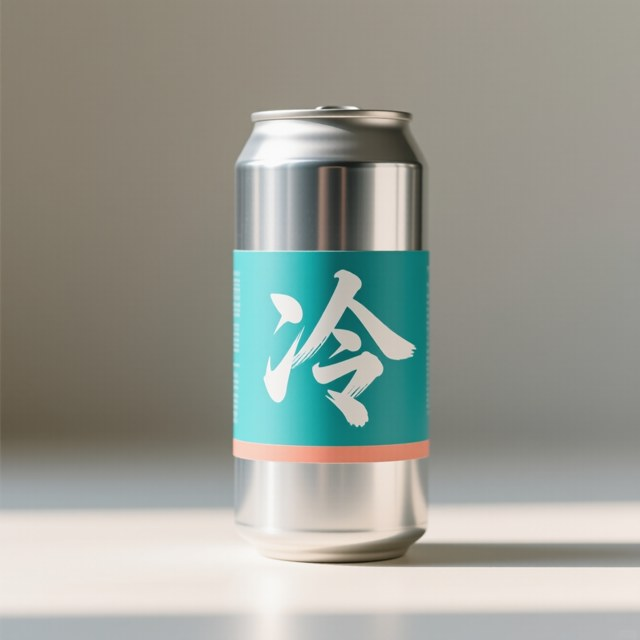
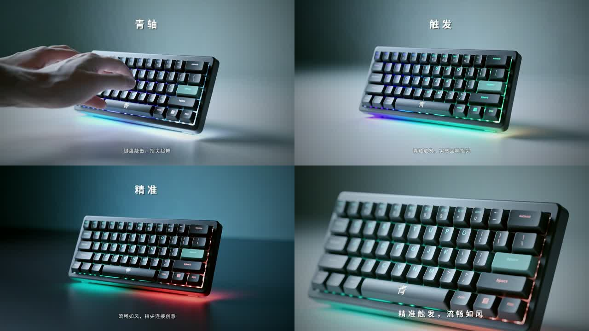
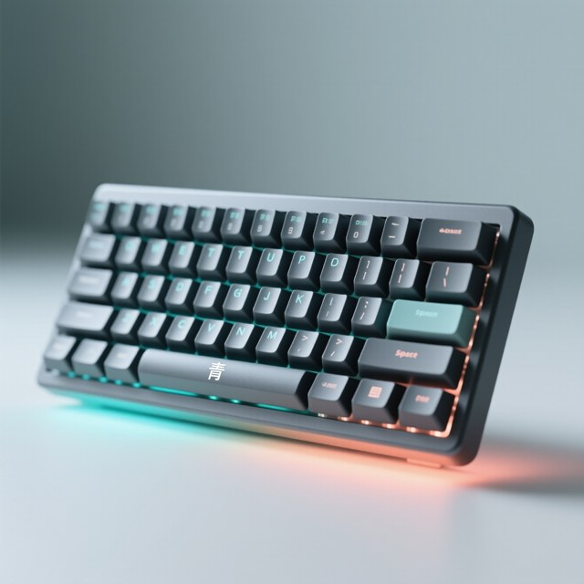
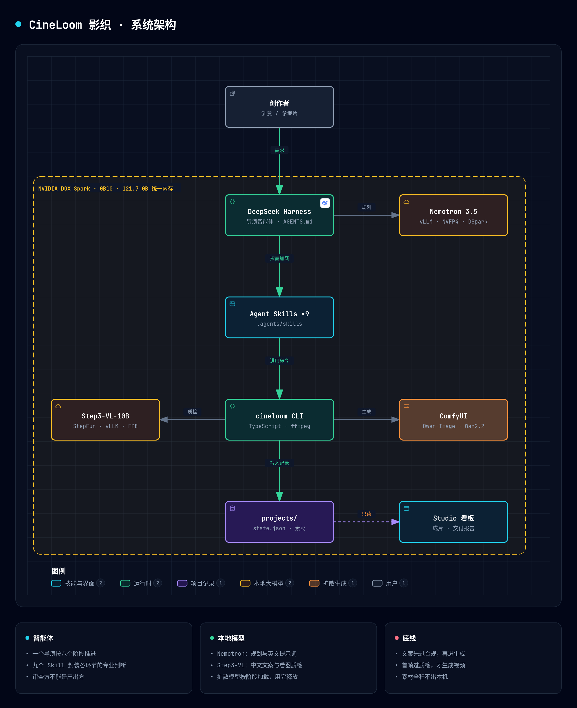

<p align="center">
  
</p>

<p align="center">
  <a href="LICENSE"></a>
  
  
  
  
</p>

<p align="center">
  <a href="#成片展示">成片展示</a> ·
  <a href="#项目说明">项目说明</a> ·
  <a href="#快速开始">快速开始</a> ·
  <a href="#部署说明">部署说明</a> ·
  <a href="#agent-skills">Agent Skills</a> ·
  <a href="#技术栈说明">技术栈</a> ·
  <a href="#已知局限">已知局限</a>
</p>

**CineLoom（影织）** 是一个运行在单台 NVIDIA DGX Spark 上的广告成片智能体：输入一句创意，交付一支画面、配音、配乐齐全，字幕正确、文案合规的短视频广告。素材、模型与生成的每一帧全程留在本机。

第三届 NVIDIA DGX Spark 黑客松 · Agent Skills 开发挑战赛参赛作品 · 方舟团队 · 十日谈征文：[《十日谈：在一台 DGX Spark 上做广告片的十天》](https://zhuanlan.zhihu.com/p/2088218312492828625)

| 痛点 | 现有 AI 视频工具 | CineLoom |
|---|---|---|
| 未发布新品的素材不能上云 | 生图、生视频走云端 API | Nemotron、Step3-VL、Qwen-Image、Wan2.2 全部运行在一台 Spark 上，断网也能出片 |
| 产品在镜头之间变样，画面里出现乱码字 | 每个镜头单独生成，模型直接画字 | 先出一张通过质检的**产品定妆图**，每一帧都以它为参考；画面**不让模型写字**，标题字幕后期用真字体排版 |
| 生成结果无人把关，返工发生在最贵的环节 | 生成完再人工检查 | 文案先过**《广告法》用词扫描与独立审稿**；每一帧先过**视觉质检**再生成视频，返工拦在约 1 分钟的生图阶段，而不是 6 分钟的生视频阶段 |

**一次真实运行**（2026 年 9 月 28 日，在 Studio 工作台提交，演示视频中的录屏即为此次）：

```text
> 给一款叫“冷”的无糖气泡水做一条 15 秒竖版短视频广告，面向大学生，夏天。电影质感：微距、冰、气泡、逆光，
  节奏克制。产品是银色铝罐，青绿色标签上有白色书法字“冷”。

  需求      1.4 s   9:16 · 15 s · 品类 food · 外观按原话锁定为“银色铝罐、青绿色标签、白色书法字”
  脚本      2.3 s   第 1 稿通过；Jev 判读“甘甜气泡填满口腔”有功效声称嫌疑（p = 0.58），交审稿裁决
  合规     49.8 s   独立审稿通过，用词扫描 0 项
  分镜     51.5 s   第 1–4 稿被退回（容器写错、一镜两个动作），第 5 稿通过
  定妆图   42.1 s   第 1 张 100 分通过
  首帧 ×3          镜头 1、2 一次通过（90 / 100 分）；镜头 3 四个候选均未通过，保留最好的一张并写入交付报告
  视频 ×3          Wan2.2 14B · 371 / 336 / 335 s
  成片             设计音色配音 ×3 + 本地配乐 + 混音 + 调色 + 字幕
  ─────────────────────────────────────────────
  总计   2495 s    全程 DGX Spark 本地 · 1080×1920 · 24 fps · 有声
```

---

## 成片展示

四支样片均由 `cineloom harness` 从一句创意在本机一次生成，未经手工修饰。竖版样片在 README 中以 16:9 画框居中播放；创意原话、四格画面、定妆图与运行记录收在每支下方的折叠块中。

### 饮料 · 无糖气泡水“冷”（15 秒竖版）

<!-- video:soda-9x16 -->

https://github.com/user-attachments/assets/72049dbb-34f5-4777-a0ce-d45e601e162e

<details>
<summary>创意原话、画面与运行记录</summary>

> 给一款叫“冷”的无糖气泡水做一条 15 秒竖版短视频广告，面向大学生，夏天。电影质感：微距、冰、气泡、逆光，节奏克制。

<p align="center"></p>
<p align="center"><br><sub>产品定妆图：每一帧都以它为参考</sub></p>

| 项目 | 记录 |
|---|---|
| 规格 | 1080×1920 · 24 fps · 16.8 秒（含 3 秒定版） |
| 口播 | 一口下去，气泡在舌尖炸开 / 无糖配方，入口即化 / 夏日清爽，随时开启 |
| 质检 | 8 次质检，1 次重生成：镜头 1 两个候选因“罐子未立起”被拒，改提示词后 100 分通过 |
| 视频 | Wan2.2 14B，367 / 346 / 343 秒 |
| 总计 | 2256 秒 |

</details>

### 数码 · 机械键盘“青”（15 秒横版）

<!-- video:keyboard-16x9 -->

https://github.com/user-attachments/assets/0afa0258-2c17-4b0c-b67c-c9be5902d0cc

<details>
<summary>创意原话、画面与运行记录</summary>

> 给机械键盘“青”做一条 15 秒横版广告，面向程序员，利落、有科技感。电影质感：暗调、冷色轮廓光、按键微距、键帽背光逐排亮起。产品是深灰色铝合金机械键盘，空格键上方有一枚小小的青色“青”字铭牌。

<p align="center"></p>
<p align="center"><br><sub>产品定妆图：每一帧都以它为参考</sub></p>

| 项目 | 记录 |
|---|---|
| 规格 | 1920×1080 · 24 fps · 16.8 秒（含 3 秒定版） |
| 迭代 | 第五版。前四版先后出现同角度重复、键帽字乱码、彩虹底光、俯拍打字、键盘变色和叠影，均已写成分镜 Skill 的 3C 拍法与校验规则 |
| 口播 | 指尖轻落，机械回弹 / 逐排背光亮起，逐键反馈清晰 / 沉浸式打字，指尖连文 |
| 质检 | 8 次质检，3 次重生成 |
| 视频 | Wan2.2 14B，370 / 354 / 346 秒 |
| 总计 | 2432 秒 |

</details>

### 护肤 · 保湿面霜“润”（15 秒竖版）

<!-- video:cream-9x16 -->

https://github.com/user-attachments/assets/85ea4ee3-bf6a-4908-850d-a8dcecc19774

<details>
<summary>创意原话、画面与运行记录</summary>

> 给国货保湿面霜“润”做一条 15 秒竖版广告，面向 25 到 35 岁女性，质感高级、安静。电影质感：乳白与暖金、柔光、水波与霜体纹理的微距。产品是磨砂白色圆罐，金色盖子，罐身有金色细体字“润”。

<p align="center"></p>
<p align="center"><br><sub>产品定妆图：每一帧都以它为参考</sub></p>

| 项目 | 记录 |
|---|---|
| 规格 | 1080×1920 · 24 fps · 16.8 秒（含 3 秒定版） |
| 迭代 | 第一版分镜照抄了 Skill 示例中的饮料罐。修复后分镜必须写出本片品牌字，定妆图三次不过即停止 |
| 口播 | 细腻入手，瞬间融合 / 肌肤如云般顺滑不黏腻 / 高级的静谧感，肌肤锁住水光 |
| 质检 | 1 次重生成 |
| 视频 | Wan2.2 14B，359 / 561 / 699 秒（后两段与另一任务并发，单独运行约 350 秒） |
| 总计 | 4564 秒（并发下） |

</details>

### 食品 · 挂耳咖啡“醒”（15 秒横版）

<!-- video:coffee-16x9 -->

https://github.com/user-attachments/assets/e726d094-b557-4999-8dcc-1f0d6348ff77

<details>
<summary>创意原话、画面与运行记录</summary>

> 给一款叫“醒”的挂耳咖啡做一条 15 秒横版广告，面向清晨通勤的上班族。电影质感：晨光、蒸汽、慢倒的热水、深色木桌，温暖克制。产品是牛皮纸色的挂耳咖啡包装盒，正面有黑色衬线字“醒”。

<p align="center"></p>
<p align="center"><br><sub>产品定妆图：每一帧都以它为参考</sub></p>

| 项目 | 记录 |
|---|---|
| 规格 | 1920×1080 · 24 fps · 16.8 秒（含 3 秒定版） |
| 迭代 | 前几版依次出现画幅选错、口播夹英文、标题“开罐”抄自示例，均已改为代码强制或校验规则 |
| 口播 | 清晨光落，咖啡香起 / 一袋挂耳，随手冲泡 / 温热入喉，清晨唤醒 |
| 质检 | 10 次质检，4 次重生成；镜头 1 要求的“咖啡粉在热水中翻涌”未能画出，保留 60 分的候选并在交付报告中标注 |
| 视频 | Wan2.2 14B，355 / 345 / 341 秒 |
| 总计 | 3645 秒 |

</details>

## 项目说明

### 核心亮点与技术实现

- **自研智能体运行时 CineLoom Harness。** `cineloom harness "一句创意"` 按需求、脚本、合规、分镜、生图、质检、生视频、成片八个阶段推进，每个阶段交给一个加载了对应 Skill 的子智能体。顺序和验收由代码负责，判断由模型负责：每份产出先过确定性校验，不合格就带着具体问题退回重写。
- **先审后生成。** 文案先过《广告法》用词扫描（本地、可复现），再交给没有参与写稿的审稿智能体；可选的 Jev 对绝对化用语、功效声称等给出校准概率。存在 `block` 级问题的文案到不了生成环节。
- **产品定妆图锁定一致性。** 先生成一张产品定妆图并过质检，之后每个镜头都以它为参考。只靠文字描述时，产品会在镜头之间漂移。
- **用户的原话优先于模型。** 创意中写明的画幅、时长与产品外观由代码逐字保留，校验器据此检查分镜，模型不能擅自改动。
- **首帧过质检才生成视频。** 阶跃星辰 Step3-VL 对照定妆图复核每一帧：内容缺失、多余文字、乱码、产品不符，任一项即拒，按问题类型改提示词重生成，最多两次。
- **画面不让模型写字。** 标题和字幕后期用真字体排版，排版前检查字体是否缺字。
- **广播级配音。** 旁白音色由 Qwen3-TTS 按文字描述设计生成，不取自任何真人；逐句克隆后经压缩、提亮、限幅处理，与 ACE-Step 本地生成的配乐自动混音。
- **可追溯。** 每支片子自动生成交付报告 `reports/delivery.md`：逐镜头质检记录、各阶段实测耗时、内存与生成位置，以及遗留问题。
- **可被其他智能体调用。** 入口 Skill `cineloom-ad-film` 已在 DeepSeek Harness 中实测：由本机 Nemotron 驱动，仅授予“工作区内修改”权限，一句需求即可加载 Skill、启动 Harness、失败时自行重试，最后读交付报告作答（演示视频 1:34 起）。

### 架构设计

<p align="center">
  
</p>

<p align="center"><sub><a href="docs/architecture/cineloom-architecture.html">可交互版本</a>（缩放、搜索、关系追踪）· 用 <a href="https://github.com/tt-a1i/archify">archify</a> 绘制</sub></p>

设计取舍：

- **分阶段推进，而不是让模型自由循环。** 广告成片本身是流水线。顺序和验收交给代码，结果稳定、可测试，“带 / 不带 Skill”的对比也能用同一套校验器评分。
- **Skill 是开放格式，不绑定运行时。** 十个 Skill 通过 `cineloom` 子命令完成工作，输入输出都是文件和 JSON，既可由 CineLoom Harness 加载，也可被 Claude Code、Codex、DeepSeek Harness 等支持 Agent Skills 的客户端直接使用。
- **按实测分工。** Nemotron 关闭思考后能在秒级给出结构化结果，负责规划、文案、审稿和英文提示词；Step3-VL 始终先推理再作答，约 18 token/秒，只负责看图。
- **一个内存池分阶段调度。** CPU 与 GPU 共用 121.7 GB 统一内存。两个语言模型常驻，Harness 在每个阶段切换时释放上一阶段的扩散模型，一次只保留一族。
- **记录即界面。** Studio 只读取 `projects/` 中的记录，本身不持有状态。

## 快速开始

```bash
git clone https://github.com/hojiahao/cineloom.git && cd cineloom
npm install && npm run build
npm test                      # 47 个测试：校验器、工具链与 CineLoom Harness 全流程

node dist/cli.js studio       # 本机打开 http://127.0.0.1:3090 ，输入创意，点“开拍”
node dist/cli.js harness "给一款叫“冷”的无糖气泡水做一条 15 秒竖版广告，面向大学生"   # 或使用命令行
```

无需 GPU 即可体验的两个命令：

```bash
echo "全网第一的气泡水，100%天然" | node dist/cli.js copy-check - --category food   # 合规扫描
node dist/cli.js shots some-ad.mp4 --out breakdown                                 # 参考片切镜
```

## 部署说明

### 1. 如何利用本地算力部署智能体

```bash
HF_ENDPOINT=https://hf-mirror.com scripts/download-models.sh   # 权重约 150 GB，可断点续传
scripts/spark-up.sh                                            # 启动 Nemotron、Step3-VL、ComfyUI 并自检
```

`spark-up.sh` 先检查统一内存余量（默认要求 95 GB 可用，不足则拒绝启动），三个服务就绪后运行 `cineloom doctor`，把工作流模板与运行中的 ComfyUI 逐节点比对，缺节点、缺权重当场报出。Harness 默认连接本机端口（Nemotron 8001、Step3-VL 8002、ComfyUI 8188），可通过 `CINELOOM_PLANNER_URL`、`CINELOOM_VISION_URL`、`COMFYUI_URL` 修改。

**配音。** 默认引擎 Kokoro 随下载脚本安装。样片使用的广告旁白音色需额外构建容器并设计一次音色：

```bash
docker build -t cineloom/qwen-tts:local deploy/spark/qwen-tts
docker run --rm --device nvidia.com/gpu=all -v "$PWD:/repo:ro" -v "${SPARK_MODEL_DIR:-$HOME/models}/tts:/models:ro" \
  -v "$PWD/runtime-data/step-audio:/work" cineloom/qwen-tts:local \
  /repo/scripts/voice-design.py --model /models/Qwen3-TTS-12Hz-1.7B-VoiceDesign --out /work/voices
export CINELOOM_TTS_ENGINE=qwen-tts CINELOOM_TTS_REF_WAV=runtime-data/step-audio/voices/male-2.wav
```

`voices/voices.json` 记录了每个音色的参考文本，将其设为 `CINELOOM_TTS_REF_TEXT` 即可。

**本地为默认，云端为可选。** 设置 `ARK_API_KEY` 后可用 `--video-model seedance` 将视频生成交给火山方舟 Seedance（协议已用模拟服务测试，未对真实服务验证）；设置 `STEPFUN_API_KEY` 后文字审稿改由 Step-3.7-Flash 承担。云端生成的素材在记录与工作台中均标注为 `cloud`。仓库中不含任何密钥。

GB10 上的环境要点已写入配置：Docker 通过 CDI（`nvidia.com/gpu=all`）使用 GPU；Step3-VL 的 FP8 权重需设置 `VLLM_USE_DEEP_GEMM=0`；ComfyUI 镜像基于 vLLM 镜像构建，复用已在 GB10 上验证的 PyTorch。启动参数取自各模型卡的 DGX Spark 配方，完整见 [`deploy/spark/compose.yaml`](deploy/spark/compose.yaml)。

### 2. 如何优化大模型

| 手段 | 做法 | 为什么 |
|---|---|---|
| NVFP4 量化 | Nemotron 3.5 Lightning 30B-A3B 用官方 NVFP4 权重，21.6 GB | 30B 参数只激活 3B，GB10 的内存带宽是瓶颈，权重越小解码越快 |
| 投机解码 | 搭配官方 `-DSpark` 草稿权重，`num_speculative_tokens=3` | NVIDIA 为 DGX Spark 低并发场景调优的方案，无损加速 |
| FP8 KV cache 与前缀缓存 | `--kv-cache-dtype fp8 --enable-prefix-caching` | 导演智能体每轮都带同一段系统提示和 Skill，前缀命中率高 |
| FP8 视觉模型 | Step3-VL-10B-FP8，15.1 GB；设 `VLLM_USE_DEEP_GEMM=0` | 质检要常驻，体积必须小。DeepGEMM 的 FP8 内核在 GB10 上断言失败，改走 vLLM 通用 FP8 路径 |
| 8 步蒸馏 LoRA | Qwen-Image + Lightning 8-step，cfg 1 | 单张 1080×1920 首帧实测 22.7 秒，质检重生成才负担得起 |
| 14B 视频模型 + 4 步蒸馏 | Wan2.2 I2V A14B（FP8，高噪/低噪两个专家）+ lightx2v 4-step LoRA | 实测 353 秒一段，不比 5B 模型（365 秒）慢，画面明显更好，因此设为默认 |
| 按任务开关思考 | 脚本、分镜、审稿关闭 Nemotron 的思考模式 | 开着时会把整个 token 额度用在推理上、正文为空；关掉后 0.3 秒出结构化结果，由校验器和重试兜底 |
| 原生分辨率预算 | 超过 1328×1328 像素总量的请求先按预算生成再放大 | 扩散耗时随像素数增长，预算内生成、Lanczos 放大 |
| 校准概率做分流 | 可选：Jev 对每句文案和每个镜头回答类型化问题（绝对化用语、健康功效、品类语感、是否要求画字、一镜多动作…），p ≥ 0.7 直接退回重写，0.3–0.7 交审稿智能体裁决 | 自由文本 JSON 的“分数”不校准（本地视觉模型几乎只给 30/40/90 三档）；类型化答案能设阈值，也不会出现“思考完没额度写结论”的故障。实测每句 1.6 s |
| 分阶段显存调度 | vLLM 按总内存池比例预占（0.25 + 0.20）；Harness 在定妆图、首帧、视频三个阶段切换时调用 ComfyUI `/free` | 三个扩散模型同时留在内存里会让 GPU 驱动分配失败（实测发生过），一次只留一族 |

**本机实测**（DGX Spark，单请求）

| 项目 | 实测值 |
|---|---|
| Nemotron 3.5 Lightning 解码速度（含 DSpark 投机解码） | 98–106 tok/s |
| Nemotron 服务占用统一内存 | 约 35 GB |
| Step3-VL-10B KV cache（内存比例 0.20） | 47,616 token，32K 上下文可用 |
| 两个语言模型常驻后的可用统一内存 | 47.6 GB |
| 定妆图（Qwen-Image，8 步） | 约 42 s（含质检约 66 s） |
| 带参考图的首帧（Qwen-Image-Edit） | 60–75 s |
| Wan2.2 I2V A14B + 4 步 LoRA，5 秒 720p 片段 | 335–370 s |
| 阶段切换释放扩散模型 | 可用内存约 27 GB → 55 GB |

**提速实验**（同一条气泡水创意）

| 改动 | 结果 |
|---|---|
| 首帧按视频工作尺寸生成（1920×1080 → 1280×704） | 视频本就在此尺寸生成，成片不变 |
| 第二个候选只在第一个被拒时生成 | 一次运行从 7 个候选降到 4 个 |
| 质检图缩至 1024 像素再送审 | 定妆图质检 84 → 24 秒 |
| 审第 N 镜首帧时并行生成第 N+1 镜 | 质检时间大部分隐藏在生图时间内 |
| vLLM 睡眠模式（生视频时释放语言模型） | 已回退：可用内存升至 104 GB，但视频每段仍约 340 秒，语言模型解码慢了一个数量级 |
| Step3-VL 跳过推理直接判定 | 已弃用：3 秒出结果，但误判合格帧 |

| 运行 | 首帧与质检 | 视频三段 | 总计 |
|---|---:|---:|---:|
| 基线 | 1141 s | 1056 s | 2256 s |
| 改动后，无返工 | 524 s | 1121 s | 1842 s（−18%） |
| 改动后，镜头 3 返工两次 | 933 s | 1066 s | 2250 s |

首帧阶段节省一半以上；视频阶段约占总时长六成，Wan2.2 14B 四步在 720p 下每段约 340 秒，不降低规格难以再压缩。

### 3. 如何设计 Agent Skills

- **一个 Skill 只管一个判断。** “写脚本”和“审脚本”是两个 Skill，且审查方不能是产出方。
- **description 写触发条件，而不是功能介绍。** 每条都写明何时使用，以及用户会说的原话（如“能不能这么说”“拉片”），智能体据此决定加载哪个 Skill。
- **确定的交给脚本，需要判断的交给模型。** 广告法用词、切镜、内存预算由 `cineloom` 命令给出可复现结果；是否有依据、如何改写才由模型判断。
- **写明失败分支。** 每个 Skill 都说明出错后怎么办：质检不过如何改提示词、切镜只得到一个镜头如何调阈值、工作流被拒先运行 `doctor`。
- **每一次失败都沉淀为规则。** 例如“标题中提到的容器必须是产品真有的”“3C 产品最多一个手镜头”，都来自真实的失败运行。
- **格式对齐 NVIDIA 官方 Skills 仓库。** frontmatter 包含 `version`、`license`、`metadata`；每个 Skill 附 `evals/evals.json`（共 29 条任务），用于“带 / 不带 Skill”的对比评测。

## Agent Skills

| Skill | 阶段 | 做什么 | 依赖的命令 / 模型 |
|---|---|---|---|
| [`ad-brief-intake`](.agents/skills/ad-brief-intake/SKILL.md) | 需求 | 只问阻塞项，其余自己定并说明，立项 | `cineloom project init` |
| [`ad-script-writing`](.agents/skills/ad-script-writing/SKILL.md) | 脚本 | 5 秒一个节拍，口播 8–18 字，标题 ≤8 字，品类语感 | Nemotron |
| [`ad-compliance-review`](.agents/skills/ad-compliance-review/SKILL.md) | 合规 | 《广告法》用词扫描 + 独立审稿智能体，`block` 级必须改写 | `cineloom copy-check` · Nemotron（另一个智能体） |
| [`ad-reference-breakdown`](.agents/skills/ad-reference-breakdown/SKILL.md) | 拉片 | 参考片切镜、逐镜描述、映射到新产品 | `cineloom shots` · Step3-VL |
| [`storyboard-design`](.agents/skills/storyboard-design/SKILL.md) | 分镜 | 产品只描述一次、风格行不带数字、画面无字、单镜单运镜、电影运镜语言 | Nemotron |
| [`spark-local-media-generation`](.agents/skills/spark-local-media-generation/SKILL.md) | 生图 / 生视频 | 定妆图 → 参考图首帧（2 候选）→ 首帧驱动视频 | `cineloom image` / `video` · Qwen-Image(-Edit) · Wan2.2 14B |
| [`shot-quality-gate`](.agents/skills/shot-quality-gate/SKILL.md) | 质检 | 对照定妆图：产品不符、多余文字、乱码、不该有的人手一票否决；按问题类型改提示词重生成 | `cineloom qa` · Step3-VL |
| [`final-cut-assembly`](.agents/skills/final-cut-assembly/SKILL.md) | 成片 | 定版、真字体标题字幕（缺字即失败）、离线配音、本地音乐并自动压低、转场调色 | `cineloom cut` · ffmpeg · Qwen3-TTS / Kokoro · ACE-Step |
| [`spark-model-scheduler`](.agents/skills/spark-model-scheduler/SKILL.md) | 贯穿 | 统一内存先量后排，分阶段加载释放 | `cineloom mem` |
| [`cineloom-ad-film`](.agents/skills/cineloom-ad-film/SKILL.md) | 入口 | 供外部智能体（Claude Code、Codex 等）调用整条 Harness：一句创意到成片，读交付报告如实汇报 | `cineloom harness` |

### 带 Skill 与不带 Skill 的对比

同一个 Nemotron、同一批 8 个创意各跑 2 轮，唯一变量是子智能体是否加载对应 Skill。每个阶段只给一次机会，由 Harness 的校验器（[`src/agent/checks.ts`](src/agent/checks.ts)）统计违规条数。三次评测全部保留：

| | 不带 Skill（9 月 21 日） | 带 Skill（9 月 21 日） | 不带 Skill（9 月 22 日） | 带 Skill（9 月 22 日） | 不带 Skill（9 月 23 日） | 带 Skill（9 月 23 日） |
|---|---:|---:|---:|---:|---:|---:|
| 脚本一次合格 | 0/16 | 6/16 | 13/16 | 15/16 | 11/16 | 14/16 |
| 脚本平均违规数 | 3.63 | 1.06 | 0.38 | 0.06 | 0.38 | 0.13 |
| 分镜一次合格 | 0/16 | 8/14 | 0/16 | 7/15 | 0/15 | 6/15 |
| 分镜平均违规数 | 8.00 | 0.71 | 3.88 | 0.80 | 3.80 | 0.80 |

9 月 22 日起，节拍数、字数、镜头数等硬性约束直接写进了阶段提示词，不带 Skill 的基线随之改善，Skill 的边际收益缩小：能写成规则的应当写进提示词，Skill 留给需要判断的部分。分镜阶段差距始终明显，不带 Skill 时的常见错误是用中文写图像提示词、一个镜头塞多个运镜、让模型画字。完整报告：[脚本](.agents/skills/ad-script-writing/BENCHMARK.md) · [分镜](.agents/skills/storyboard-design/BENCHMARK.md) · 原始数据 [第一次](eval/results/ablation.json) · [第二次](eval/results/ablation-v2.json) · [第三次](eval/results/ablation-v3.json)。复现：`cineloom eval --repeats 2`。

## Studio

`node dist/cli.js studio` 在 `http://127.0.0.1:3090` 提供网页工作台：输入创意，选择画幅、时长和视频模型，点“开拍”即在后台开始制作（一次一支）。页面实时显示运行日志、八个阶段的状态、按镜头排列的首帧与片段、每个素材的生成位置与耗时、成片与交付报告，以及统一内存占用。地址后加 `?record=1` 进入录制模式，只显示最近的一支片子。

## 技术栈说明

**NVIDIA**

| 组件 | 用途 |
|---|---|
| DGX Spark（GB10 Grace Blackwell，aarch64，统一内存） | 全部推理与生成的运行平台 |
| `nvidia/NVIDIA-Nemotron-3.5-Lightning-30B-A3B-NVFP4` | **每一支片子都在用**：需求、文案、审稿、分镜与英文提示词；也是 DeepSeek Harness 调用 CineLoom 时的驱动模型 |
| `nvidia/NVIDIA-Nemotron-3.5-Lightning-30B-A3B-NVFP4-DSpark` | 为 DGX Spark 调优的投机解码草稿权重 |
| NVFP4 量化（TensorRT Model Optimizer 产出的官方权重） | 降低权重体积与带宽压力 |
| NVIDIA Container Toolkit（CDI） | GPU 容器运行时：vLLM、ComfyUI 与两个配音容器都通过 `nvidia.com/gpu=all` 使用 GPU |
| CUDA | vLLM 与 ComfyUI 的计算后端 |
| [NVIDIA/skills](https://github.com/NVIDIA/skills) 规范 | Skill 的 frontmatter、`evals/`、评测报告格式对齐 |

**StepFun 阶跃星辰**

| 组件 | 用途 |
|---|---|
| `stepfun-ai/Step3-VL-10B-FP8`（本地，vLLM） | **每一支片子都在用**：定妆图与每一帧对照复核（质检），参考片逐镜理解 |
| Step-3.7-Flash（StepFun 开放平台 API，可选，样片未使用） | 创意总监级的方案发散。198B 参数，IQ4_XS 量化仍需约 116 GB，无法与扩散模型同机共存，因此走云端并在记录里标注 `cloud` |
| `stepfun-ai/Step-Audio-EditX`（本地，可选配音引擎，最终样片未使用） | 从参考音克隆音色并按风格重新演绎口播；`CINELOOM_TTS_ENGINE=step-audio` 启用。在 vLLM 0.27 与 transformers 5 上需两处本地补丁（`deploy/spark/step-audio/apply-patches.sh`） |

**其他开源组件**

| 组件 | 用途 |
|---|---|
| vLLM | 两个 LLM 的 OpenAI 兼容服务 |
| ComfyUI · Qwen-Image / Qwen-Image-Edit-2509（含 Lightning 8-step LoRA） | 首帧生成；带产品参考图的生成；能渲染中文字 |
| ComfyUI · Wan2.2 I2V A14B（FP8）+ lightx2v 4-step LoRA | 默认视频模型：首帧驱动的 5 秒片段 |
| ComfyUI · Wan2.2 TI2V-5B | 备选视频模型，支持无首帧的文生视频 |
| ffmpeg · libass | 参考片切镜、尾帧续接；成片的转场、调色、颗粒、暗角、真字体标题字幕与混音 |
| Qwen3-TTS-12Hz-1.7B VoiceDesign / Base（本地，容器 `cineloom/qwen-tts`） | 样片与演示片的配音：VoiceDesign 按文字描述设计出不存在的旁白音色（`scripts/voice-design.py`），Base 用这段参考音逐句克隆，再过广播级后期链（压缩、提亮、限幅）。`CINELOOM_TTS_ENGINE=qwen-tts` 启用 |
| Kokoro-82M-v1.1-zh | 离线中文配音的默认引擎，无需额外容器 |
| [Jev](https://docs.typesafe.ai/)（TypeSafe，云端 API，可选） | 结构化评估：对文案和分镜提出类型化问题，返回校准概率；`TYPESAFE_API_KEY` 存在时启用，只发送文本，记录标为 `cloud` |
| ComfyUI · ACE-Step v1 3.5B | 本地生成器乐背景音乐 |
| TypeScript · Node.js 22 · Vitest | CineLoom Harness、CLI、Studio 与测试（零运行时依赖） |

## 已知局限

- **制作耗时较长。** 一支 15 秒成片在本机约 30 到 40 分钟，其中视频生成约占六成。
- **个别镜头可能带着瑕疵交付。** 一个镜头最多重生成两次，仍不合格时保留得分最高的一张继续，并在交付报告中标注。
- **新品类需要补充拍法。** 3C 产品经过五版迭代才稳定，新品类可能需要先在分镜 Skill 中补充对应拍法。
- **暂无音效层。** 目前只有口播与配乐。

本仓库中的性能数据均为实测。

## 目录

```text
AGENTS.md                导演智能体的流水线与规则
.agents/skills/          10 个 Agent Skill（9 个阶段 Skill + 1 个入口 Skill；SKILL.md · references · evals）
src/agent/               CineLoom Harness：导演与子智能体、校验器、评测
src/                     cineloom CLI、媒体管线与 Studio（TypeScript）
workflows/               ComfyUI API 格式的工作流模板
deploy/spark/            本地推理栈（compose）、Harness 提供方配置
scripts/                 模型下载、一键启动、音色设计、演示视频生成与录屏
docs/                    架构图、开发日志、演示脚本、十日谈征文、B 站投稿材料
eval/                    评测用创意与原始结果
tests/                   单元测试与端到端流水线测试
```

## 致谢与许可

CineLoom 以 [MIT 许可证](LICENSE) 发布，版权归方舟团队所有。运行时依赖 vLLM、ComfyUI 以及 NVIDIA、StepFun、Qwen、Wan 等团队开源的模型，各自遵循其许可证。样片中的品牌均为虚构，配音音色由模型按文字描述生成，不取自任何真人。使用 CineLoom 生成并对外发布的内容，请按平台规范标注“AI 生成”。
